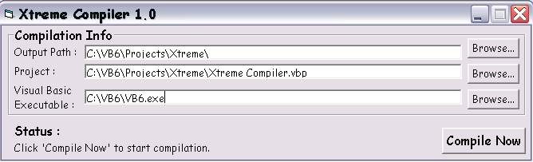



## Xtreme Compiler 1\.0

### Description

Compile the project another way without opening the project. Although this code uses visual basic executable, it operates the executable in the background. I wish to credit someone on PSC for his piece of code. Please vote.
 
### More Info
 

             |
---                |---
**Submitted On**   |2003-09-06 23:08:06
**By**             |[Lam Ri Hui](https://github.com/Planet-Source-Code/PSCIndex/blob/master/ByAuthor/lam-ri-hui.md)
**Level**          |Beginner
**User Rating**    |4.7 (28 globes from 6 users)
**Compatibility**  |VB 4\.0 \(16\-bit\), VB 4\.0 \(32\-bit\), VB 5\.0, VB 6\.0
**Category**       |[Complete Applications](https://github.com/Planet-Source-Code/PSCIndex/blob/master/ByCategory/complete-applications__1-27.md)
**World**          |[Visual Basic](https://github.com/Planet-Source-Code/PSCIndex/blob/master/ByWorld/visual-basic.md)
**Archive File**   |[Xtreme\_Com164243972003\.zip](https://github.com/Planet-Source-Code/lam-ri-hui-xtreme-compiler-1-0__1-48331/archive/master.zip)

